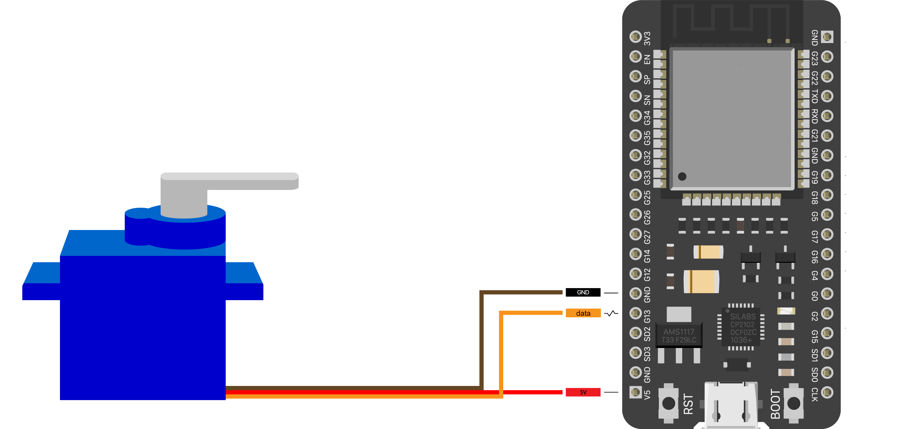

# SwitchBot
Arduino sketch used to control a small robot, based on ESP32 and a Micro Servo, which physically toggles a switch or press a button.
It can be triggered via MQTT sending messages to the topic defined in `MQTT.h` in two modes:
- button. It is like pressing the buttons on the elevator panel or the Nespresso coffee machine. You can configure it to press and hold for 0, 1, 2 or more seconds before releasing.
Example of message:
```json
{"angle": 150, "time": 1000} #ms

```
- switch. It is meant for those rocker switch. It can push and pull the rocker switch. 
Example of message:
```json
{"angle": 150}

```

## Home Assistant
MQTT allows an easy integration in Home Assistant using [MQTT Switch platform](https://www.home-assistant.io/integrations/switch.mqtt/).
```yaml
switch:
  - platform: mqtt
      availability_topic: tele/switchbot_A57C16/LWT
      command_topic: cmnd/switchbot_A57C16/SERVO
      icon: mdi:toggle-switch
      name: switchbot_A57C16
      payload_available: Online
      payload_not_available: Offline
      payload_off: '{"angle": 60, "time": 500}'
      payload_on: '{"angle": 120, "time": 500}'
      retain: false
```

## Hardware
- ESP32
- Microservo




## Enjoy SwitchBot